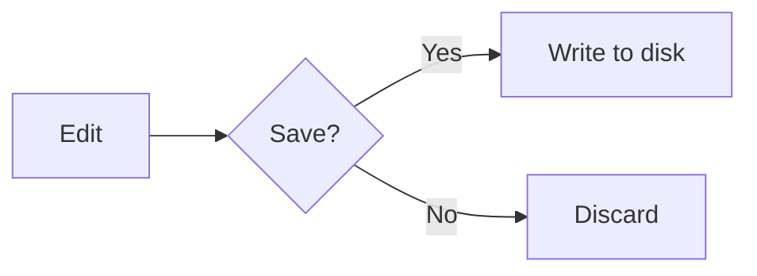

<div align="center">

# Note++ ✦

### A developer-focused desktop text editor

*Notepad++ reimagined for the modern web stack — powered by Monaco, Electron, and an integrated terminal.*

[](https://www.electronjs.org/)
[](https://microsoft.github.io/monaco-editor/)
[](https://mermaid.js.org/)
[](#)
[](#license)

[Download](https://github.com/YogeshPraj/Note-/releases) • [Quick Start](#-quick-start) • [Features](#-features) • [Architecture](#-architecture) • [Roadmap](#-roadmap) • [Contributing](#-contributing)

</div>

---

## 📖 About

**Note++** is what happens when you take the spirit of Notepad++ and rebuild it on a modern foundation. It's not trying to be another VS Code, and it's not trying to be a generic notepad — it sits comfortably in between: fast to launch, low-friction to use, but with the editing power developers actually need day to day.

Under the hood it runs the same **Monaco** editor that powers VS Code, wrapped in a lightweight **Electron** shell, with an integrated **xterm** terminal, live preview for HTML and Markdown, **Mermaid** diagram rendering, and cloud session sync across Google Drive, OneDrive, and Dropbox.

> Built for developers who want a snappy editor on hand — not a full IDE, not a plain text box.

---

## 📑 Table of Contents

- [Features](#-features)
- [Quick Start](#-quick-start)
- [Tech Stack](#-tech-stack)
- [Project Structure](#-project-structure)
- [Architecture](#-architecture)
- [Keyboard Shortcuts](#-keyboard-shortcuts)
- [Live Preview & Mermaid](#-live-preview--mermaid)
- [Roadmap](#-roadmap)
- [Contributing](#-contributing)
- [License](#-license)

---

## ✨ Features

### Editing
- **Multi-tab editor** powered by Monaco — the engine behind VS Code
- **Syntax highlighting** for 50+ languages out of the box
- **IntelliSense** auto-complete for JavaScript, TypeScript, and friends
- **Find & Replace** with full regex support
- **Command Palette** (`Ctrl+Shift+P`) and **Quick Open** (`Ctrl+P`)
- **Bookmarks**, breadcrumbs, minimap, word wrap toggles

### Productivity
- **Integrated terminal** (xterm + PowerShell)
- **File tree sidebar** for fast navigation
- **Live preview** for HTML and Markdown (`Ctrl+Shift+V`)
- **Mermaid diagrams** rendered inline in Markdown and bare `.mmd` files
- **Run file** with a single keystroke (`F5`)

### Developer tools
- **Code formatting** — JSON, XML, language-aware
- **Base64** encode / decode
- **Regex tester** with live matching
- **Sort lines**, remove duplicates, remove empty lines, case conversion

### Polish
- **Dark / light mode** toggle
- **Cloud session sync** (Google Drive, OneDrive, Dropbox)
- **Auto-save** session — pick up exactly where you left off
- **Zoom** controls, configurable preferences, status bar with line/col/encoding/EOL

---

## 🚀 Quick Start

### Prerequisites

- **Node.js** 18 or newer
- **Windows** (primary target — other platforms untested)
- **Git** (optional, for cloning)

### Install & run

```bash
# Clone the repo
git clone https://github.com/YogeshPraj/Note-.git
cd Note-

# Install dependencies
npm install

# Launch the app
npm start
```

Or simply **double-click `launch.bat`** from the project root.

### Build a distributable

```bash
npm run build
```

> ⚠️ `electron-builder` needs to be added to `devDependencies` first — see [Roadmap](#-roadmap).

---

## 🧱 Tech Stack

| Layer       | Technology                                     |
| ----------- | ---------------------------------------------- |
| Runtime     | Electron 28                                    |
| Editor      | Monaco Editor 0.45.0                           |
| Markdown    | marked v18.0.3                                 |
| Diagrams    | Mermaid v11.14.0                               |
| Terminal    | xterm 5.3 + xterm-addon-fit                    |
| Security    | `contextIsolation: true`, `nodeIntegration: false` |
| Node bridge | `src/preload.js` → `window.electronAPI`        |

---

## 📁 Project Structure

```
Note++/
├── package.json          ← "main": "src/main.js"
├── launch.bat            ← double-click to run
├── CLAUDE.md             ← Claude session context
└── src/
    ├── main.js           ← Electron main process
    ├── preload.js        ← IPC bridge (window.electronAPI)
    ├── index.html        ← Renderer entry point
    ├── renderer.js       ← All UI logic
    ├── style.css         ← All styles
    ├── monaco-worker.js  ← Monaco web worker helper
    └── assets/           ← 21 SVG toolbar icons
```

---

## 🏛️ Architecture

### IPC Pattern

Note++ follows Electron's recommended security model — `contextIsolation` is **on**, `nodeIntegration` is **off**. All filesystem and Node access flows through `preload.js`, which exposes a narrow API on `window.electronAPI`.

```
Renderer (renderer.js)
    │
    │  window.electronAPI.readFile(path)
    ▼
Preload (preload.js)  ← context bridge
    │
    │  ipcRenderer.invoke('read-file', path)
    ▼
Main process (main.js)  ← Node.js, fs, dialog, etc.
```

The renderer **never calls `require()` directly** — that's the whole point of the bridge.

### Critical loading order

Monaco's `vs/loader.js` installs a global `define()`. If `marked.umd.js` loads *after* it, marked registers itself as an AMD module and `window.marked` is never set, breaking the Markdown preview. The fix:

```html
<!-- index.html — order matters -->
<script src="../node_modules/marked/lib/marked.umd.js"></script>     <!-- 1. MUST be first -->
<script src="../node_modules/monaco-editor/min/vs/loader.js"></script><!-- 2 -->
<script src="../node_modules/xterm/lib/xterm.js"></script>           <!-- 3 -->
<script src="../node_modules/mermaid/dist/mermaid.min.js"></script>  <!-- 4 -->
<script src="renderer.js"></script>                                  <!-- 5 -->
```

---

## ⌨️ Keyboard Shortcuts

| Shortcut         | Action               |
| ---------------- | -------------------- |
| `Ctrl+P`         | Quick Open           |
| `Ctrl+Shift+P`   | Command Palette      |
| `Ctrl+Shift+V`   | Toggle Live Preview  |
| `Ctrl+F`         | Find                 |
| `Ctrl+H`         | Replace              |
| `F5`             | Run current file     |
| `Ctrl++` / `Ctrl+-` | Zoom in / out     |

A full list lives inside the Command Palette.

---

## 🎨 Live Preview & Mermaid

Note++ ships with a split-pane preview for HTML and Markdown:

- **Toggle** with `Ctrl+Shift+V` or the 👁 toolbar button
- **Resizable** drag handle between editor and preview
- **400 ms debounce** on keystrokes — no jitter while typing
- **Markdown**: parsed by `marked.parse()`, with a custom code-fence renderer that hands `mermaid` blocks to Mermaid
- **HTML**: rendered in a sandboxed `<iframe srcdoc>` with the Mermaid script injected into `<head>`
- **Bare Mermaid files** (no fences, starting with `graph`/`flowchart`/etc.) are auto-detected and rendered directly

Example — a Mermaid block in any `.md` file:

````markdown

````

…will render live in the preview pane as you type.

---

## 🗺️ Roadmap

Things that exist as stubs or wishes today:

- [ ] `node-pty` integration so terminal resize stops being approximate
- [ ] Add `electron-builder` to `devDependencies` and wire up `npm run build`
- [ ] Diff view and basic Git integration in-editor
- [ ] LSP server connections beyond Monaco's built-in JS/TS IntelliSense
- [ ] Finish the `pref-new-doc` and `pref-backup` preference pages (UI exists, logic doesn't)
- [ ] macOS / Linux builds

---

## 🤝 Contributing

Contributions are welcome. The project is small and easy to read end-to-end — `renderer.js` is the heart of it, `main.js` is the Electron shell.

**Good first issues:**
- Pick anything from the [Roadmap](#-roadmap)
- Add a new entry to the Command Palette (`renderer.js` → `cmdItems`)
- Add syntax themes
- Improve keyboard shortcut coverage

**Workflow:**
1. Fork the repo
2. Create a branch (`git checkout -b feature/your-thing`)
3. Commit with a clear message
4. Open a PR against `main`

---

## 🔒 Security

Note++ runs untrusted file content (and HTML previews of it) inside the renderer. The defenses in place:

- `contextIsolation: true`, `nodeIntegration: false`
- HTML preview is rendered inside a **sandboxed `<iframe srcdoc>`**
- All filesystem and Node access funnels through a narrow preload API

If you find a vulnerability, please open a private security advisory on GitHub rather than a public issue.

---

## 📄 License

MIT — see `LICENSE` for the fine print.

---

<div align="center">

**Built with curiosity, Monaco, and a lot of Electron docs.**

[Report a bug](https://github.com/YogeshPraj/Note-/issues) • [Request a feature](https://github.com/YogeshPraj/Note-/issues)

</div>
