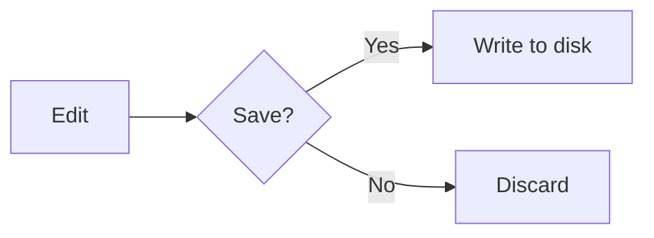

<div align="center">

# Note++ ✦

### A developer-focused desktop text editor

*Notepad++ reimagined for the modern web stack — powered by Monaco, Electron, an integrated terminal, local AI, a real source-control panel, and a hand-drawn whiteboard.*

[](https://github.com/YogeshPraj/Note-/releases/latest)
[](https://github.com/YogeshPraj/Note-/releases)
[](https://github.com/YogeshPraj/Note-/releases/latest)
[](https://github.com/YogeshPraj/Note-/actions/workflows/release.yml)
[](https://github.com/YogeshPraj/Note-/stargazers)
[](#-license)

[](https://www.electronjs.org/)
[](https://microsoft.github.io/monaco-editor/)
[](https://excalidraw.com/)
[](https://mermaid.js.org/)
[](https://ollama.com/)
[](#)

[**📥 Download**](https://github.com/YogeshPraj/Note-/releases/latest) • [Quick Start](#-quick-start) • [Features](#-features) • [Architecture](#-architecture) • [Roadmap](#-roadmap)

</div>

---

## 📖 About

**Note++** is what happens when you take the spirit of Notepad++ and rebuild it on a modern foundation. It's not trying to be another VS Code, and it's not trying to be a generic notepad — it sits comfortably in between: fast to launch, low-friction to use, with the editing power developers actually need day to day, plus a handful of opinionated extras you won't find anywhere else.

Under the hood it runs the same **Monaco** engine that powers VS Code, in a lightweight **Electron** shell, with an integrated **xterm** terminal (true PTY via `node-pty`), live preview for HTML and Markdown, **Mermaid** diagrams, an **Excalidraw**-powered hand-drawn whiteboard, a full **Git source-control panel**, a **local AI assistant** (Ollama with Agent mode + multi-turn chat + quick-action chips), per-file **AES-256-GCM encryption**, **Compare** (file & folder diff like Diff.Net / WinMerge), **Recent Files**, an **external-change file watcher**, and cloud session sync.

> Built for developers who want a snappy editor that does more than just edit text — not a full IDE, not a plain text box.

---

## 📑 Table of Contents

- [Features](#-features)
- [Quick Start](#-quick-start)
- [Tech Stack](#-tech-stack)
- [Project Structure](#-project-structure)
- [Architecture](#-architecture)
- [Git Integration](#-git-integration)
- [AI Assistant](#-ai-assistant)
- [Encrypted Pad](#-encrypted-pad)
- [Whiteboard](#-whiteboard)
- [Compare (File & Folder Diff)](#-compare-file--folder-diff)
- [Find / Replace / Mark / Find in Files](#-find--replace--mark--find-in-files)
- [Live Preview & Mermaid](#-live-preview--mermaid)
- [Keyboard Shortcuts](#-keyboard-shortcuts)
- [Roadmap](#-roadmap)
- [Contributing](#-contributing)
- [License](#-license)

---

## ✨ Features

### Editing
- **Multi-tab editor** powered by Monaco — the engine behind VS Code
- **50+ language** syntax highlighters out of the box
- **IntelliSense** auto-complete for JavaScript, TypeScript, and friends
- **Find / Replace / Mark / Find in Files** — Notepad++-style search results panel, multi-colour persistent highlights, gutter+minimap markers update live as you type
- **Command Palette** (`Ctrl+Shift+P`) and **Quick Open** (`Ctrl+P`)
- **Bookmarks**, breadcrumbs, minimap, word wrap toggles
- **Recent Files** menu (last 15, deduped, stale entries auto-pruned)
- **External-change watcher** — clean tabs auto-reload; dirty tabs ask first
- **Snappy by default** — no ligatures (`!=` stays `!=`), no caret animations, no smooth scrolling, no inline color decorators

### Compare
- **Compare two files** — side-by-side Monaco diff editor (or inline), syntax-highlighted, next/prev change navigation
- **Compare two folders** — side-by-side tree with `added · removed · differ · equal` colour coding (Diff.Net / WinMerge style)
- **Click a differing file row** in the folder-diff → opens that file's diff in a new tab
- **Right-click a tab** → `Select for Compare`, then on another tab → `Compare with selected`
- Skips `node_modules / .git / dist / build / out / .next / .cache / .vscode / .idea / __pycache__`
- See [`DIFF.md`](./features/DIFF.md) for the design

### Source control
- **Auto-detected Git repos** — opens any file and Note++ walks up for `.git`
- **Source Control side panel** (`Ctrl+Shift+G`) — VS Code-style staging, commit, branches
- **Status-bar pill** showing branch · ahead/behind · dirty count
- **File-tree decorations** — color-coded `M / A / D / R / U / ?` badges on every changed file
- **Push, pull, sync, fetch** with one click; respects your `pull.rebase` config
- **Branch switch + create** from a dropdown menu
- **Auto-refresh** on window focus + after save + after every git op; background `git fetch` every 3 min

### AI Assistant (local, private, free)
- **One-click setup** — clicking 🤖 detects Ollama, auto-starts the daemon, auto-downloads `qwen2.5-coder:1.5b` if no models installed
- **Multi-turn chat** — full conversation history; ask follow-ups, refine answers
- **Agent mode** ⚡ — AI's reply replaces editor content via a **Monaco diff editor preview**: review, then Apply or Reject
- **Quick-action chips** — `✨ Polish` · `🔧 Refactor` · `📝 Comments` · `🧪 Tests` · `💡 Explain` · `📓 Memory`
- **`AGENTS.md` support** — vendor-neutral standard adopted by Cursor / Codex / Copilot / Cline / Codex / Jules / Gemini / Windsurf / Zed — auto-injected into the AI system prompt for any repo containing one
- **`.notepp/memory.md`** — Note++-specific per-project instructions, auto-loaded every turn
- **Multi-model picker** — pick separate models for Chat vs Agent (e.g. fast `qwen2.5-coder:1.5b` for chat, beefier `deepseek-coder:6.7b` for agent)
- **Selection-aware** — highlight a function → Agent → "convert to TypeScript"
- **Streaming responses** with token-by-token preview
- **Action bar** in chat mode: Insert at cursor / Replace selection / Append / Replace entire file
- **Six recommended models** from Ollama in the picker — Phi, Llama, Qwen, DeepSeek, Gemma

### Encrypted pad
- **Per-file encryption** with a single profile-wide password
- **AES-256-GCM** + **PBKDF2-SHA-256** (600 000 iterations) + **gzip** pre-compression
- **Recovery key** — Crockford base32, displayed once at setup, downloadable as JSON
- **Auto-detect on open** — encrypted files prompt for unlock, decrypt in memory, look like normal files
- **Toolbar 🔒** to encrypt the active tab; 🔒 badge on the tab name; 🔒 status-bar indicator
- **Standard JSON envelope on disk** — versioned, inspectable, future-proof
- See [`ENCRYPTION.md`](./features/ENCRYPTION.md) for the full threat model and design

### Whiteboard
- **Hand-drawn canvas** powered by **Excalidraw 0.18** — same engine as excalidraw.com
- Rectangles, ellipses, diamonds, arrows, lines, freedraw, text, images, libraries, frames, laser pointer
- **Auto-saves** as `whiteboard-N.json` per tab; 1.5 s debounced writes
- **`.excalidraw` file format** native support; opens raw Excalidraw exports too
- **v1 → v2 migration** on load — old custom-canvas whiteboards still open

### Productivity
- **Integrated terminal** (xterm + true PTY via `node-pty`) — proper resize, ANSI colours, full PowerShell/bash
- **File tree sidebar** for fast navigation
- **Live preview** for HTML and Markdown (`Ctrl+Shift+V`) — with **zoom controls** (`Ctrl+Wheel`) and a **⛶ maximise** button that hides the editor pane
- **Mermaid Live Editor** for `.mmd` / `.mermaid` files — auto-opens split pane, templates, SVG/PNG export, zoom
- **Run file** with a single keystroke (`F5`)
- **Cloud session sync** — Google Drive, OneDrive, Dropbox
- **Auto-save session** — pick up exactly where you left off; encrypted tabs re-prompt unlock
- **Auto-backup** to a configurable location with version retention
- **File-association double-click** — open any `.txt / .md / .json / .html / .excalidraw / …` file with Note++ from Windows Explorer (deferred-flush IPC so the file always loads even if the renderer is still booting)

### Developer tools
- **Code formatting** — JSON, XML, language-aware
- **Base64** encode / decode
- **Regex tester** with live matching
- **Sort lines**, remove duplicates, remove empty lines, case conversion

### Polish
- **Dark / light mode** toggle with first-class theming for every panel and modal
- **Zoom** controls, configurable preferences, status bar with line/col/length/encoding/EOL/language
- **About dialog** with a clickable credit and live version info

---

## 🚀 Quick Start

### Install (prebuilt installer)

Grab the latest installer from [Releases](https://github.com/YogeshPraj/Note-/releases/latest):

```
Note++-Setup-x.y.z.exe
```

Run it, walk through NSIS, done. Note++ registers itself as a handler for `.txt`, `.md`, `.json`, `.html`, `.excalidraw`, and friends — right-click any file → **Open with Note++**.

### Run from source

```bash
# Prerequisites: Node.js 18+, Git, Windows (primary target)

git clone https://github.com/YogeshPraj/Note-.git
cd Note-
npm install        # auto-runs `npm run build:wb` via postinstall
npm start          # or double-click launch.bat
```

### Build the installer yourself

```bash
npm run build      # electron-builder, produces dist/Note++-Setup-*.exe
```

---

## 🧱 Tech Stack

| Layer            | Technology                                                    |
| ---------------- | ------------------------------------------------------------- |
| Runtime          | Electron 28                                                   |
| Editor           | Monaco Editor 0.45                                            |
| Markdown         | marked v18                                                    |
| Diagrams         | Mermaid v11                                                   |
| Whiteboard       | Excalidraw 0.18 + React 18 (bundled via esbuild into iframe)  |
| Terminal         | xterm 5.3 + xterm-addon-fit + **node-pty 1.1** (true PTY)     |
| AI               | **Ollama** (local LLM via HTTP at `127.0.0.1:11434`)          |
| File diff        | Monaco's built-in `createDiffEditor`                          |
| Folder diff      | **`dir-compare`** (content-hash comparison, MIT)              |
| Crypto           | Web Crypto API — AES-256-GCM, PBKDF2-SHA-256, HKDF            |
| Compression      | Native `CompressionStream` / `DecompressionStream`            |
| Bundler          | esbuild 0.24 (only for the Excalidraw iframe app)             |
| Security         | `contextIsolation: true`, `nodeIntegration: false`            |
| Node bridge      | `src/preload.js` → `window.electronAPI`                       |
| Platform         | Windows (primary), Node.js                                    |

---

## 📁 Project Structure

```
Note++/
├── package.json              ← "main": "src/main.js"
├── launch.bat                ← double-click to run
├── build-whiteboard.js       ← esbuild script: bundles Excalidraw + copies fonts
├── CLAUDE.md                 ← Claude session context
├── features/                 ← per-feature design specs
│   ├── AGENT.md              ← AI agent-mode spec
│   ├── DIFF.md               ← Compare (file + folder diff) spec
│   ├── ENCRYPTION.md         ← encrypted-pad feature spec
│   ├── GIT.md                ← git integration spec
│   ├── LSP.md                ← language-server-protocol integration spec
│   └── ROADMAP.md            ← three-tier feature roadmap (Tier 1 / 2 / 3)
├── tools/                    ← scratch / legacy artefacts not in the shipped app
└── src/
    ├── main.js               ← Electron main process (IPC, file dialogs, menus)
    ├── preload.js            ← IPC bridge (window.electronAPI)
    ├── index.html            ← Renderer entry point
    ├── renderer.js           ← All UI logic (~6000 lines)
    ├── style.css             ← All styles
    ├── monaco-worker.js      ← Monaco web worker helper
    ├── crypto.js             ← AES-GCM / PBKDF2 / HKDF / gzip (encrypted pad)
    ├── git-service.js        ← Git CLI wrapper (main process)
    ├── whiteboard.html       ← Excalidraw iframe shell
    ├── whiteboard-app.jsx    ← React + Excalidraw entry (source)
    ├── whiteboard.bundle.*   ← generated by esbuild (gitignored)
    ├── excalidraw-fonts/     ← generated, self-hosted fonts (gitignored)
    ├── mermaid-live-view.html← Mermaid Live Editor overlay
    ├── assets/               ← SVG toolbar icons
    └── games/                ← in-app HTML games (Dev Arcade)
```

---

## 🏛️ Architecture

### IPC Pattern

Note++ follows Electron's recommended security model — `contextIsolation` is **on**, `nodeIntegration` is **off**. All filesystem, Node, and `git`/`ollama` access flows through `preload.js`, which exposes a narrow API on `window.electronAPI`.

```
Renderer (renderer.js)
    │
    │  window.electronAPI.readFile(path)
    │  window.electronAPI.git.status(repoRoot)
    │  window.electronAPI.aiChat({ model, messages })
    ▼
Preload (preload.js)  ← context bridge
    │
    │  ipcRenderer.invoke('read-file', path)
    ▼
Main process (main.js + git-service.js)  ← Node.js, fs, dialog, child_process
```

The renderer **never calls `require()` directly** — that's the whole point of the bridge.

### Critical loading order

Monaco's `vs/loader.js` installs a global `define()`. If `marked.umd.js` loads *after* it, marked registers itself as an AMD module and `window.marked` is never set, breaking the Markdown preview:

```html
<!-- index.html — order matters -->
<script src="../node_modules/marked/lib/marked.umd.js"></script>     <!-- 1. MUST be first -->
<script src="../node_modules/monaco-editor/min/vs/loader.js"></script><!-- 2 -->
<script src="../node_modules/xterm/lib/xterm.js"></script>           <!-- 3 -->
<script src="../node_modules/mermaid/dist/mermaid.min.js"></script>  <!-- 4 -->
<script src="crypto.js"></script>                                    <!-- 5 -->
<script src="renderer.js"></script>                                  <!-- 6 -->
```

### Whiteboard bundle

Excalidraw is bundled separately by `build-whiteboard.js` (esbuild) into `src/whiteboard.bundle.{js,css}` and loaded inside the `whiteboard.html` iframe. React lives only inside that iframe; the main renderer stays vanilla JS. Fonts are self-hosted under `src/excalidraw-fonts/` — no CDN call. See [`CLAUDE.md`](./CLAUDE.md) for the full whiteboard architecture and v1→v2 format migration.

---

## 🔀 Git Integration

Note++ ships with a full Source Control workflow — see [`GIT.md`](./features/GIT.md) for the spec.

| | |
|---|---|
| Open the panel | `Ctrl+Shift+G` or click `⎇` in the toolbar |
| Backend | Shells out to the system `git` CLI (`child_process.spawn`) |
| Detection | Walks up from the active file's folder looking for `.git` |
| Status format | `git status --porcelain=v1 -b -z` (NUL-separated; handles paths with spaces) |
| Refresh | On focus + after save + after any git op; background `git fetch` every 3 min |
| Auth | Inherits system credential manager (Windows Credential Manager / Keychain / `git-credential`) |
| Out of scope (v1) | Inline diff gutter, blame annotations, merge conflict UI, multi-repo aggregation |

Panel features:
- **Commit message** + ✓ Commit + ↺ Amend (Ctrl+Enter shortcut inside the textarea)
- **Staged** and **Changes** lists with per-file Stage / Unstage / Discard buttons
- **Stage All / Unstage All / Discard All** (Discard All confirms first)
- **Push / Pull / Sync / Fetch** buttons; Sync = pull then push
- **Branch picker** — switch existing or create new
- **File-tree badges** color-coded per status

---

## 🤖 AI Assistant

Local, private, free. Powered by Ollama on `127.0.0.1:11434`.

### One-click setup

Click 🤖 in the toolbar and Note++:
1. Detects whether Ollama is installed (PATH + standard install locations)
2. Starts the Ollama daemon if it's installed but not running (`ollama serve` detached)
3. Downloads `qwen2.5-coder:1.5b` (~1 GB) if you have no models yet — with a live progress bar
4. Picks the first installed model and connects

If Ollama isn't installed at all, the panel shows an **Open download page** button linking to ollama.com/download.

### Chat mode vs Agent mode

Toggle in the panel header — **`🤖 Chat`** ↔ **`⚡ Agent`**:

- **Chat** (default): conversation thread, follow-ups, action bar lets you Insert / Replace / Append the latest reply
- **Agent**: AI's reply replaces the editor content via a **Monaco diff editor preview**. You see exactly what's changing, then Apply or Reject. Multi-turn — each follow-up rebuilds the system prompt from your current editor content so iterations work naturally

See [`AGENT.md`](./features/AGENT.md) for the full spec.

---

## 🔒 Encrypted Pad

Per-file encryption with a single profile-wide password. Open a `.txt` (or anything) → click 🔒 → confirm — file is saved as an encrypted JSON envelope. Re-open it later → password prompt → decrypt in memory → looks like a normal file.

| | |
|---|---|
| Cipher | AES-256-GCM (authenticated encryption) |
| KDF | PBKDF2-HMAC-SHA-256, 600 000 iterations (OWASP 2023 minimum) |
| Compression | gzip before encryption (negates the base64 overhead; typical text files **shrink** vs the plaintext) |
| Recovery | 256-bit random key, Crockford base32 (~32 readable chars, no ambiguous `O/0/I/L`) |
| Recovery file | Downloadable `recovery.json` containing the key |
| Disk format | Inspectable JSON envelope with `_notepp_encrypted: true`, salt, IV, ciphertext |
| Profile location | `%AppData%\notepp\encryption\profile.json` (wrapped DEK only, never the plaintext) |
| Threat model | See [`ENCRYPTION.md`](./features/ENCRYPTION.md) |

---

## 🎨 Whiteboard

Powered by **Excalidraw 0.18** running in an iframe. Same engine as excalidraw.com — hand-drawn shapes, rough.js style, full keyboard parity.

- Rectangle, ellipse, diamond, arrow, line, freedraw, text, image, library, frame, laser pointer
- Auto-saves to `%AppData%\notepp\Whiteboards\whiteboard-N.json` (1.5 s debounce)
- Open existing `.excalidraw` files from anywhere — Note++ detects raw Excalidraw exports and routes them correctly
- v1 → v2 format migration on load (old custom-canvas whiteboards still open)

---

## 🆚 Compare (File & Folder Diff)

Inspired by Diff.Net / WinMerge / Beyond Compare. Two flavours, both render as new tabs.

| | |
|---|---|
| Engine (files)   | Monaco's built-in `createDiffEditor` (zero new deps) |
| Engine (folders) | [`dir-compare`](https://www.npmjs.com/package/dir-compare) — content-hash comparison |
| Tab type         | `'diff'` (file) or `'folder-diff'` (folder) with an orange badge |
| Spec             | [`DIFF.md`](./features/DIFF.md) |

### File compare

Entry points:
- `File → Compare → Compare Files…` — pick two files
- `File → Compare → Compare with Saved…` — compare current tab vs a picked file
- **Right-click a tab → `Select for Compare`** → right-click another tab → **`Compare with selected`**

Inside the diff tab:
- Side-by-side or inline view (toggle in the toolbar)
- Full Monaco syntax highlighting per file language
- `↑ Prev` / `↓ Next` change navigation
- `⇆ Swap` reverses left ↔ right
- `↻ Reload` re-reads both files from disk

### Folder compare

Entry point: `File → Compare → Compare Folders…`

Inside the folder-diff tab:
- Two-column side-by-side tree
- Summary header: `N added · N removed · N differ · N equal`
- Colour coding:
  - 🟢 Green — only on right (added)
  - 🔴 Red — only on left (removed)
  - 🟡 Yellow — in both, content differs
- **Click a differing file row → opens that file's diff in a new tab**
- `Show only changes` checkbox hides equal entries (on by default)
- Skips `node_modules / .git / dist / build / out / .next / .cache / .vscode / .idea / __pycache__`

---

## 🔎 Find / Replace / Mark / Find in Files

Four-tab search panel with a Notepad++-style results panel:

### Live decorations (Find)
- Yellow bar + ● dot in the gutter on every match line
- Orange bar + larger orange dot on the **current** match
- Yellow ticks on the right-side scrollbar minimap for match density
- All update **live as you type** (120 ms debounce)
- Status bar shows `3 of 58 matches`

### Find in Files
- Recursive search via the main process — pick a directory, set a filter (`*.js,*.md`), hit `Find in Files`
- Results grouped per file in the green-headed panel; click any row → opens the file + jumps to the line
- Skips the same heavy folders as Compare; caps at 5 000 files / 5 000 hits

### Mark
- Pick a colour (yellow / cyan / pink / green / orange) → `Mark All`
- Persistent coloured highlight — **stacks** across multiple Marks with different colours
- Survives closing the Find panel; clear with `Clear Marks`

---

## 🎨 Live Preview & Mermaid

Note++ ships with a split-pane preview for HTML and Markdown:

- **Toggle** with `Ctrl+Shift+V` or the 👁 toolbar button
- **Resizable** drag handle between editor and preview
- **Zoom controls** in the preview header (−, %, +) and `Ctrl+Wheel` inside the body
- **⛶ Maximise** toggle — preview takes the full editor row, hiding the editor pane
- **400 ms debounce** on keystrokes — no jitter while typing
- **Markdown** parsed by `marked.parse()`, with a custom renderer that hands `mermaid` blocks to Mermaid
- **HTML** rendered in a sandboxed `<iframe srcdoc>` with the Mermaid script injected into `<head>`
- **Bare Mermaid files** (no fences, starting with `graph`/`flowchart`/etc.) auto-detected and rendered directly
- **`.mmd` / `.mermaid` files** open in a dedicated Mermaid Live Editor split with templates, SVG/PNG export, and zoom (`Ctrl+scroll` works too)

Example — a Mermaid block in any `.md` file:

````markdown

````

…renders live as you type.

---

## ⌨️ Keyboard Shortcuts

| Shortcut             | Action                                |
| -------------------- | ------------------------------------- |
| `Ctrl+N`             | New tab                               |
| `Ctrl+O`             | Open file                             |
| `Ctrl+S` / `Ctrl+Shift+S` | Save / Save All                 |
| `Ctrl+W`             | Close tab                             |
| `Ctrl+P`             | Quick Open                            |
| `Ctrl+Shift+P`       | Command Palette                       |
| `Ctrl+Shift+G`       | Toggle Source Control                 |
| `Ctrl+Shift+A`       | Toggle AI Assistant                   |
| `Ctrl+Alt+Shift+G`   | Open Dev Arcade games tab             |
| `Ctrl+Shift+V`       | Toggle Live Preview                   |
| `Ctrl+F`             | Find                                  |
| `Ctrl+Shift+F`       | Format Document                       |
| `Ctrl+H`             | Replace                               |
| `Ctrl+G`             | Go to Line                            |
| `Ctrl+`` `           | Toggle Terminal                       |
| `F5`                 | Run file                              |
| `F12`                | Go to definition                      |
| `Shift+F12`          | Go to references                      |
| `F2`                 | Rename symbol                         |
| `Ctrl+Alt+W`         | Toggle word wrap                      |
| `Ctrl+Alt+D`         | Toggle dark mode                      |
| `Ctrl++` / `Ctrl+-`  | Zoom in / out                         |

A full list lives inside the Command Palette (`Ctrl+Shift+P`).

---

## 🗺️ Roadmap

### Done
- [x] `node-pty` integration — true PTY with proper resize
- [x] `electron-builder` packaging + GitHub Actions release workflow
- [x] Git integration in editor (Source Control panel + branch ops)
- [x] Auto-backup with version retention
- [x] AI Assistant (Ollama) with multi-turn chat + Agent mode
- [x] Encrypted pad with recovery key
- [x] Excalidraw-powered whiteboard
- [x] **Compare** — file diff (Monaco) + folder diff (dir-compare, Diff.Net-style tree)
- [x] **Find in Files** — recursive search across a folder, results panel
- [x] **Mark** — multi-colour persistent highlights
- [x] **Recent Files** menu (last 15, persisted)
- [x] **External-change file watcher** — auto-reload / "Keep mine" prompt
- [x] `AGENTS.md` + `.notepp/memory.md` auto-injected into AI prompt
- [x] Multi-model picker (chat vs agent)
- [x] Preview pane zoom + maximise
- [x] Snappy editor defaults (no ligatures / caret animations / smooth scroll)
- [x] Find live decorations (gutter + minimap markers, current-match indicator)

### Next
- [ ] Inline git diff gutter (added/modified/deleted markers in editor)
- [ ] LSP server connections beyond Monaco's built-in JS/TS IntelliSense
- [ ] Git blame and history view
- [ ] macOS / Linux builds
- [ ] Hunk-by-hunk apply/reject in Agent mode diff
- [ ] Windows Hello integration for encryption unlock
- [ ] MCP client support — connect to community MCP servers (filesystem, GitHub, etc.)
- [ ] Inline AI completion (Cursor-Tab style) via Ollama FIM
- [ ] Voice input — proper `whisper.cpp` native bindings (the previous transformers.js attempt was unstable in Electron and was removed)

---

## 🤝 Contributing

Contributions are welcome. The project is small and easy to read end-to-end — `renderer.js` is the heart of it, `main.js` is the Electron shell, and each spec file (in [`features/`](./features/) — `ENCRYPTION.md`, `GIT.md`, `AGENT.md`, `DIFF.md`, `ROADMAP.md`) documents its own feature in detail.

**Good first issues:**
- Pick anything from the [Roadmap](#-roadmap)
- Add a new entry to the Command Palette (`renderer.js` → `cmdItems`)
- Add a Monaco syntax theme
- Improve keyboard shortcut coverage
- Help with macOS / Linux build support

**Workflow:**
1. Fork the repo
2. Create a branch (`git checkout -b feature/your-thing`)
3. Commit with a clear message
4. Open a PR against `main`

---

## 🔒 Security

Note++ runs untrusted file content (and HTML previews of it) inside the renderer. The defenses in place:

- `contextIsolation: true`, `nodeIntegration: false`
- HTML preview is rendered inside a **sandboxed `<iframe srcdoc>`**
- All filesystem and Node access funnels through a narrow preload API
- Whiteboard runs in its own iframe with its own CSP, separate from the parent renderer
- AI traffic stays **local** — Ollama runs on `127.0.0.1:11434`, no remote calls
- Encrypted pad uses standard Web Crypto API primitives — no rolled-our-own crypto

If you find a vulnerability, please open a private security advisory on GitHub rather than a public issue.

---

## 📄 License

MIT — see `LICENSE` for the fine print.

---

<div align="center">

**Built with curiosity, Monaco, and a lot of Electron docs.**

Created by [**Yogesh Prajapati**](https://github.com/YogeshPraj)

[Report a bug](https://github.com/YogeshPraj/Note-/issues) • [Request a feature](https://github.com/YogeshPraj/Note-/issues) • [Releases](https://github.com/YogeshPraj/Note-/releases)

</div>
