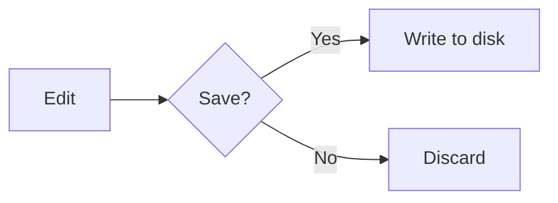

<div align="center">

# Note++ ✦

### A developer-focused desktop text editor

*Notepad++ reimagined for the modern web stack — powered by Monaco, Electron, an integrated terminal, local AI, a real source-control panel, language-server IntelliSense, draw.io structured diagrams, and a hand-drawn whiteboard.*

[](https://github.com/YogeshPraj/Note-/releases/latest)
[](https://github.com/YogeshPraj/Note-/releases)
[](https://github.com/YogeshPraj/Note-/releases/latest)
[](https://github.com/YogeshPraj/Note-/actions/workflows/release.yml)
[](https://github.com/YogeshPraj/Note-/stargazers)
[](#-license)

[](https://www.electronjs.org/)
[](https://microsoft.github.io/monaco-editor/)
[](https://excalidraw.com/)
[](https://www.drawio.com/)
[](https://mermaid.js.org/)
[](https://ollama.com/)
[](https://github.com/YogeshPraj/Note-/releases/latest/download/notepp-win-x64.exe)
[](https://github.com/YogeshPraj/Note-/releases/latest)
[](https://github.com/YogeshPraj/Note-/releases/latest/download/notepp-linux-x64.AppImage)

[**📥 Download**](https://github.com/YogeshPraj/Note-/releases/latest) • [Quick Start](#-quick-start) • [Features](#-features) • [Architecture](#-architecture) • [Roadmap](#-roadmap)

</div>

---

## 📖 About

**Note++** is what happens when you take the spirit of Notepad++ and rebuild it on a modern foundation. It's not trying to be another VS Code, and it's not trying to be a generic notepad — it sits comfortably in between: fast to launch, low-friction to use, with the editing power developers actually need day to day, plus a handful of opinionated extras you won't find anywhere else.

Under the hood it runs the same **Monaco** engine that powers VS Code, in a lightweight **Electron** shell, with an integrated **xterm** terminal (true PTY via `node-pty`), live preview for HTML and Markdown, **Mermaid** diagrams, an **Excalidraw**-powered hand-drawn whiteboard, **draw.io** structured diagrams (downloaded on demand, persists across upgrades), **Language Server Protocol** integration (Pyright for Python, click-to-install), a full **Git source-control panel** with inline diff gutter, a **local AI assistant** (Ollama with Agent mode + multi-turn chat + quick-action chips), per-file **AES-256-GCM encryption**, **Compare** (file & folder diff like Diff.Net / WinMerge), **Recent Files**, an **external-change file watcher**, **silent auto-update** with a polished progress window, and cloud session sync. Ships for **Windows, macOS, and Linux**.

> Built for developers who want a snappy editor that does more than just edit text — not a full IDE, not a plain text box.

---

## 📑 Table of Contents

- [Features](#-features)
- [Quick Start](#-quick-start)
- [Tech Stack](#-tech-stack)
- [Project Structure](#-project-structure)
- [Architecture](#-architecture)
- [Git Integration](#-git-integration)
- [AI Assistant](#-ai-assistant)
- [Language Server Protocol (LSP)](#-language-server-protocol-lsp)
- [draw.io Diagrams](#-drawio-diagrams)
- [Encrypted Pad](#-encrypted-pad)
- [Whiteboard](#-whiteboard)
- [Compare (File & Folder Diff)](#-compare-file--folder-diff)
- [Find / Replace / Mark / Find in Files](#-find--replace--mark--find-in-files)
- [Live Preview & Mermaid](#-live-preview--mermaid)
- [Auto-Update](#-auto-update)
- [Keyboard Shortcuts](#-keyboard-shortcuts)
- [Roadmap](#-roadmap)
- [Contributing](#-contributing)
- [License](#-license)

---

## ✨ Features

### Editing
- **Multi-tab editor** powered by Monaco — the engine behind VS Code
- **50+ language** syntax highlighters out of the box
- **IntelliSense** auto-complete for JavaScript, TypeScript, and friends
- **Language Server Protocol** — real diagnostics + hover + completion + go-to-definition for **Python (Pyright)**; click-to-install pill in the status bar when the server isn't present
- **Find / Replace / Mark / Find in Files** — Notepad++-style search results panel, multi-colour persistent highlights, gutter+minimap markers update live as you type
- **Inline git diff gutter** — green/blue/red bars on every changed line vs `HEAD`, updates as you edit
- **Persistent UI toggles** — Word Wrap, Dark Mode, Zoom, Minimap, etc. survive a restart (saved to `settings.json`)
- **Command Palette** (`Ctrl+Shift+P`) and **Quick Open** (`Ctrl+P`)
- **Bookmarks**, breadcrumbs, minimap, word wrap toggles
- **Recent Files** menu (last 15, deduped, stale entries auto-pruned)
- **External-change watcher** — clean tabs auto-reload; dirty tabs ask first
- **Snappy by default** — no ligatures (`!=` stays `!=`), no caret animations, no smooth scrolling, no inline color decorators

### Compare
- **Compare two files** — side-by-side Monaco diff editor (or inline), syntax-highlighted, next/prev change navigation
- **Compare two folders** — side-by-side tree with `added · removed · differ · equal` colour coding (Diff.Net / WinMerge style)
- **Click a differing file row** in the folder-diff → opens that file's diff in a new tab
- **Right-click a tab** → `Select for Compare`, then on another tab → `Compare with selected`
- Skips `node_modules / .git / dist / build / out / .next / .cache / .vscode / .idea / __pycache__`
- See [`DIFF.md`](./features/DIFF.md) for the design

### Source control
- **Auto-detected Git repos** — opens any file and Note++ walks up for `.git`
- **Source Control side panel** (`Ctrl+Shift+G`) — VS Code-style staging, commit, branches
- **Status-bar pill** showing branch · ahead/behind · dirty count
- **File-tree decorations** — color-coded `M / A / D / R / U / ?` badges on every changed file
- **Push, pull, sync, fetch** with one click; respects your `pull.rebase` config
- **Branch switch + create** from a dropdown menu
- **Auto-refresh** on window focus + after save + after every git op; background `git fetch` every 3 min

### AI Assistant (local, private, free)
- **One-click setup** — clicking 🤖 detects Ollama, auto-starts the daemon, auto-downloads `qwen2.5-coder:1.5b` if no models installed
- **Multi-turn chat** — full conversation history; ask follow-ups, refine answers
- **Agent mode** ⚡ — AI's reply replaces editor content via a **Monaco diff editor preview**: review, then Apply or Reject
- **Quick-action chips** — `✨ Polish` · `🔧 Refactor` · `📝 Comments` · `🧪 Tests` · `💡 Explain` · `📓 Memory`
- **`AGENTS.md` support** — vendor-neutral standard adopted by Cursor / Codex / Copilot / Cline / Codex / Jules / Gemini / Windsurf / Zed — auto-injected into the AI system prompt for any repo containing one
- **`.notepp/memory.md`** — Note++-specific per-project instructions, auto-loaded every turn
- **Multi-model picker** — pick separate models for Chat vs Agent (e.g. fast `qwen2.5-coder:1.5b` for chat, beefier `deepseek-coder:6.7b` for agent)
- **Selection-aware** — highlight a function → Agent → "convert to TypeScript"
- **Streaming responses** with token-by-token preview
- **Action bar** in chat mode: Insert at cursor / Replace selection / Append / Replace entire file
- **Six recommended models** from Ollama in the picker — Phi, Llama, Qwen, DeepSeek, Gemma

### Encrypted pad
- **Per-file encryption** with a single profile-wide password
- **AES-256-GCM** + **PBKDF2-SHA-256** (600 000 iterations) + **gzip** pre-compression
- **Recovery key** — Crockford base32, displayed once at setup, downloadable as JSON
- **Auto-detect on open** — encrypted files prompt for unlock, decrypt in memory, look like normal files
- **Toolbar 🔒** to encrypt the active tab; 🔒 badge on the tab name; 🔒 status-bar indicator
- **Standard JSON envelope on disk** — versioned, inspectable, future-proof
- See [`ENCRYPTION.md`](./features/ENCRYPTION.md) for the full threat model and design

### Whiteboard (hand-drawn)
- **Excalidraw 0.18** in an iframe — same engine as excalidraw.com
- Rectangles, ellipses, diamonds, arrows, lines, freedraw, text, images, libraries, frames, laser pointer
- **Save lifecycle matches text tabs** — red dot on first edit, `Ctrl+S` prompts Save As for new tabs; session auto-save guards unsaved work against crashes
- **`.excalidraw` file format** native support; opens raw Excalidraw exports too
- **v1 → v2 migration** on load — old auto-backed whiteboards still open and migrate cleanly on first save

### Diagrams (structured — draw.io)
- **Full draw.io editor** in an iframe — pinned to v30.0.2, runs entirely offline (`stealth=1`)
- **Downloaded on demand** the first time you open a `.drawio` file or click `Tools → Diagram (draw.io) → New Diagram` (~40 MB, one-time)
- **Bundle persists across upgrades** — lives in `userData`, electron-updater leaves it untouched
- **Starter templates** in `Tools → Diagram (draw.io) → From Template`: Flowchart · Sequence Diagram · Class Diagram (UML) · Entity Relationship
- **Manual update check** — `Tools → Diagram (draw.io) → Check for updates` compares the installed version to whatever Note++ has pinned

### Productivity
- **Integrated terminal** (xterm + true PTY via `node-pty`) — proper resize, ANSI colours, full PowerShell/bash
- **File tree sidebar** for fast navigation
- **Live preview** for HTML and Markdown (`Ctrl+Shift+V`) — with **zoom controls** (`Ctrl+Wheel`) and a **⛶ maximise** button that hides the editor pane
- **Mermaid Live Editor** for `.mmd` / `.mermaid` files — auto-opens split pane, templates, SVG/PNG export, zoom
- **Run file** with a single keystroke (`F5`)
- **Cloud session sync** — Google Drive, OneDrive, Dropbox
- **Auto-save session** — pick up exactly where you left off; encrypted tabs re-prompt unlock
- **Auto-backup** to a configurable location with version retention
- **File-association double-click** — open any `.txt / .md / .json / .html / .excalidraw / .drawio / …` file with Note++ from Windows Explorer / macOS Finder / Linux file managers (deferred-flush IPC so the file always loads even if the renderer is still booting)
- **Auto-update** — silent background download via `electron-updater`; the toolbar pill on the right edge surfaces `New update available → Downloading X% → Click to update`. Clicking opens a dedicated progress window with a success animation, then relaunches. Settings → `Check for Updates Automatically` to disable.

### Developer tools
- **Code formatting** — JSON, XML, language-aware
- **Base64** encode / decode
- **Regex tester** with live matching
- **Sort lines**, remove duplicates, remove empty lines, case conversion

### Polish
- **Dark / light mode** toggle with first-class theming for every panel and modal
- **Zoom** controls, configurable preferences, status bar with line/col/length/encoding/EOL/language
- **About dialog** with a clickable credit and live version info

---

## 🚀 Quick Start

### Install (prebuilt installer)

Grab the latest installer for your OS from [Releases](https://github.com/YogeshPraj/Note-/releases/latest):

**Pick the right file for your OS** — every link below resolves permanently to the **latest release** (no per-version URL maintenance):

| OS | Two options |
| --- | --- |
| **Windows** (x64) | 📦 [Installer (.exe)](https://github.com/YogeshPraj/Note-/releases/latest/download/notepp-win-x64.exe) · 📁 [Portable (.zip)](https://github.com/YogeshPraj/Note-/releases/latest/download/notepp-win-x64.zip) |
| **macOS** | 🍎 [Intel (.dmg)](https://github.com/YogeshPraj/Note-/releases/latest/download/notepp-mac-x64.dmg) · 🍎 [Apple Silicon (.dmg)](https://github.com/YogeshPraj/Note-/releases/latest/download/notepp-mac-arm64.dmg) |
| **Linux** (x64) | 🐧 [Portable (.AppImage)](https://github.com/YogeshPraj/Note-/releases/latest/download/notepp-linux-x64.AppImage) · 🐧 [Debian/Ubuntu (.deb)](https://github.com/YogeshPraj/Note-/releases/latest/download/notepp-linux-x64.deb) |

Filenames are version-less by design — the actual version is shown in the installer UI, the About dialog, and on the [Releases page](https://github.com/YogeshPraj/Note-/releases) title. You'll also see a handful of `*-mac.zip` / `*.blockmap` / `latest*.yml` files in each release — those are auto-updater payloads, not for manual download.

Note++ registers itself as a handler for `.txt`, `.md`, `.json`, `.html`, `.excalidraw`, `.drawio` and friends — right-click any file → **Open with Note++**.

> **macOS first launch:** builds are currently unsigned. Right-click → **Open** the first time to bypass Gatekeeper.
> **Linux AppImage:** on Ubuntu 24.04+ you may need `sudo apt install libfuse2t64`.

### Run from source

```bash
# Prerequisites: Node.js 18+, Git, one of Windows / macOS / Linux

git clone https://github.com/YogeshPraj/Note-.git
cd Note-
npm install        # auto-runs `npm run build:wb` via postinstall
npm start          # or double-click launch.bat (Windows)
```

### Build the installer yourself

```bash
npm run build          # auto-detects current OS

# Or target a specific platform explicitly
npm run build:win      # Windows  → NSIS .exe
npm run build:msi      # Windows  → MSI installer
npm run build:mac      # macOS    → .dmg + .zip (x64 + arm64)
npm run build:linux    # Linux    → AppImage + .deb (x64)
```

> Cross-platform builds must run on the target OS (native modules like `node-pty` compile per-OS). The 3-OS GitHub Actions matrix handles this for releases — tag push → parallel builds on `windows-latest` / `macos-latest` / `ubuntu-latest`.

---

## 🧱 Tech Stack

| Layer              | Technology                                                          |
| ------------------ | ------------------------------------------------------------------- |
| Runtime            | Electron 32 (Node 20.18, Chromium 128)                              |
| Editor             | Monaco Editor 0.45                                                  |
| Markdown           | marked v18                                                          |
| Diagrams (hand)    | Excalidraw 0.18 + React 18 (bundled via esbuild into iframe)        |
| Diagrams (struct.) | **draw.io v30** (downloaded on demand, served via `drawio://` protocol) |
| Diagrams (mermaid) | Mermaid v11                                                         |
| Inline git diff    | `diff` (jsdiff)                                                     |
| LSP                | Pyright (Python) via stdio JSON-RPC; custom client wired to Monaco  |
| Terminal           | xterm 5.3 + xterm-addon-fit + **node-pty 1.1** (true PTY)           |
| AI                 | **Ollama** (local LLM via HTTP at `127.0.0.1:11434`)                |
| Auto-update        | `electron-updater` + GitHub provider                                |
| File diff          | Monaco's built-in `createDiffEditor`                                |
| Folder diff        | **`dir-compare`** (content-hash comparison, MIT)                    |
| Crypto             | Web Crypto API — AES-256-GCM, PBKDF2-SHA-256, HKDF                  |
| Compression        | Native `CompressionStream` / `DecompressionStream`                  |
| Bundler            | esbuild 0.24 (only for the Excalidraw iframe app)                   |
| Security           | `contextIsolation: true`, `nodeIntegration: false`                  |
| Node bridge        | `src/preload.js` → `window.electronAPI`                             |
| Platforms          | Windows · macOS (x64 + arm64) · Linux (AppImage + .deb)             |

---

## 📁 Project Structure

```
Note++/
├── package.json              ← "main": "src/main.js"
├── launch.bat                ← double-click to run
├── build-whiteboard.js       ← esbuild script: bundles Excalidraw + copies fonts
├── CLAUDE.md                 ← Claude session context
├── features/                 ← per-feature design specs
│   ├── AGENT.md              ← AI agent-mode spec
│   ├── DIFF.md               ← Compare (file + folder diff) spec
│   ├── ENCRYPTION.md         ← encrypted-pad feature spec
│   ├── GIT.md                ← git integration spec
│   ├── LSP.md                ← language-server-protocol integration spec
│   └── ROADMAP.md            ← three-tier feature roadmap (Tier 1 / 2 / 3)
├── tools/                    ← scratch / legacy artefacts not in the shipped app
└── src/
    ├── main.js               ← Electron main process (IPC, file dialogs, menus)
    ├── preload.js            ← IPC bridge (window.electronAPI)
    ├── index.html            ← Renderer entry point
    ├── renderer.js           ← All UI logic (~6500 lines)
    ├── style.css             ← All styles
    ├── monaco-worker.js      ← Monaco web worker helper
    ├── crypto.js             ← AES-GCM / PBKDF2 / HKDF / gzip (encrypted pad)
    ├── git-service.js        ← Git CLI wrapper (main process)
    ├── lsp-service.js        ← Main-process LSP subprocess manager + JSON-RPC framing
    ├── lsp-client.js         ← Renderer-side bridge: Monaco providers ↔ LSP requests
    ├── drawio-service.js     ← On-demand download + extract for draw.io bundle
    ├── drawio.html           ← draw.io iframe shell (postMessage broker)
    ├── whiteboard.html       ← Excalidraw iframe shell
    ├── whiteboard-app.jsx    ← React + Excalidraw entry (source)
    ├── whiteboard.bundle.*   ← generated by esbuild (gitignored)
    ├── excalidraw-fonts/     ← generated, self-hosted fonts (gitignored)
    ├── mermaid-live-view.html← Mermaid Live Editor overlay
    ├── updater.html          ← Auto-update progress + success window
    ├── updater-preload.js    ← Strict preload for the updater window
    ├── assets/               ← SVG toolbar icons
    └── games/                ← in-app HTML games (Dev Arcade)
```

---

## 🏛️ Architecture

### IPC Pattern

Note++ follows Electron's recommended security model — `contextIsolation` is **on**, `nodeIntegration` is **off**. All filesystem, Node, and `git`/`ollama` access flows through `preload.js`, which exposes a narrow API on `window.electronAPI`.

```
Renderer (renderer.js)
    │
    │  window.electronAPI.readFile(path)
    │  window.electronAPI.git.status(repoRoot)
    │  window.electronAPI.aiChat({ model, messages })
    ▼
Preload (preload.js)  ← context bridge
    │
    │  ipcRenderer.invoke('read-file', path)
    ▼
Main process (main.js + git-service.js)  ← Node.js, fs, dialog, child_process
```

The renderer **never calls `require()` directly** — that's the whole point of the bridge.

### Critical loading order

Monaco's `vs/loader.js` installs a global `define()`. **Every UMD script that exposes its API via `window.X` must load before `vs/loader.js`**, otherwise they register as anonymous AMD modules and never set their global (we hit this twice — first with marked, then again with xterm in v1.4.1):

```html
<!-- index.html — order matters -->
<script src="../node_modules/marked/lib/marked.umd.js"></script>     <!-- 1 -->
<script src="../node_modules/xterm/lib/xterm.js"></script>           <!-- 2 -->
<script src="../node_modules/xterm-addon-fit/lib/xterm-addon-fit.js"></script>  <!-- 3 -->
<script src="../node_modules/mermaid/dist/mermaid.min.js"></script>  <!-- 4 -->
<script src="../node_modules/diff/dist/diff.min.js"></script>        <!-- 5 -->
<script src="../node_modules/monaco-editor/min/vs/loader.js"></script><!-- 6. AFTER all UMD -->
<script src="crypto.js"></script>                                    <!-- 7 -->
<script src="lsp-client.js"></script>                                <!-- 8 -->
<script src="renderer.js"></script>                                  <!-- 9 -->
```

### Whiteboard bundle

Excalidraw is bundled separately by `build-whiteboard.js` (esbuild) into `src/whiteboard.bundle.{js,css}` and loaded inside the `whiteboard.html` iframe. React lives only inside that iframe; the main renderer stays vanilla JS. Fonts are self-hosted under `src/excalidraw-fonts/` — no CDN call. See [`CLAUDE.md`](./CLAUDE.md) for the full whiteboard architecture and v1→v2 format migration.

### draw.io bundle (downloaded on demand)

draw.io is **not** bundled with the installer. The first time you open a `.drawio` file or click `New Diagram`, `src/drawio-service.js` (main process) downloads `draw.war` from GitHub releases, extracts it via `extract-zip`, and writes a `version.json` marker into `userData/drawio-bundle/`. The iframe loads `drawio://app/index.html?embed=1&proto=json&…` via a custom privileged protocol (`registerSchemesAsPrivileged` + `registerFileProtocol` with a path-traversal guard). `src/drawio.html` brokers the embed-mode `postMessage` protocol between the inner drawio iframe and the parent renderer (`dw-load` / `dw-state` / `dw-ready` / `dw-theme`), mirroring the whiteboard shell pattern.

### Language Server Protocol

`src/lsp-service.js` (main) spawns one subprocess per language with stdio JSON-RPC framing (`Content-Length: <n>\r\n\r\n<body>`). `src/lsp-client.js` (renderer) registers Monaco completion / hover / definition providers that translate to `textDocument/*` LSP requests, and feeds diagnostics through `setModelMarkers`. Adding a new language is one entry in the `LSP_LANGUAGES` registry plus a Monaco language id mapping.

---

## 🔀 Git Integration

Note++ ships with a full Source Control workflow — see [`GIT.md`](./features/GIT.md) for the spec.

| | |
|---|---|
| Open the panel | `Ctrl+Shift+G` or click `⎇` in the toolbar |
| Backend | Shells out to the system `git` CLI (`child_process.spawn`) |
| Detection | Walks up from the active file's folder looking for `.git` |
| Status format | `git status --porcelain=v1 -b -z` (NUL-separated; handles paths with spaces) |
| Refresh | On focus + after save + after any git op; background `git fetch` every 3 min |
| Auth | Inherits system credential manager (Windows Credential Manager / Keychain / `git-credential`) |
| Out of scope (v1) | Inline diff gutter, blame annotations, merge conflict UI, multi-repo aggregation |

Panel features:
- **Commit message** + ✓ Commit + ↺ Amend (Ctrl+Enter shortcut inside the textarea)
- **Staged** and **Changes** lists with per-file Stage / Unstage / Discard buttons
- **Stage All / Unstage All / Discard All** (Discard All confirms first)
- **Push / Pull / Sync / Fetch** buttons; Sync = pull then push
- **Branch picker** — switch existing or create new
- **File-tree badges** color-coded per status

---

## 🤖 AI Assistant

Local, private, free. Powered by Ollama on `127.0.0.1:11434`.

### One-click setup

Click 🤖 in the toolbar and Note++:
1. Detects whether Ollama is installed (PATH + standard install locations)
2. Starts the Ollama daemon if it's installed but not running (`ollama serve` detached)
3. Downloads `qwen2.5-coder:1.5b` (~1 GB) if you have no models yet — with a live progress bar
4. Picks the first installed model and connects

If Ollama isn't installed at all, the panel shows an **Open download page** button linking to ollama.com/download.

### Chat mode vs Agent mode

Toggle in the panel header — **`🤖 Chat`** ↔ **`⚡ Agent`**:

- **Chat** (default): conversation thread, follow-ups, action bar lets you Insert / Replace / Append the latest reply
- **Agent**: AI's reply replaces the editor content via a **Monaco diff editor preview**. You see exactly what's changing, then Apply or Reject. Multi-turn — each follow-up rebuilds the system prompt from your current editor content so iterations work naturally

See [`AGENT.md`](./features/AGENT.md) for the full spec.

---

## 🐍 Language Server Protocol (LSP)

Real diagnostics, hover docs, completion, and go-to-definition — driven by the actual language server (not Monaco's built-in shallow analyser). Currently ships with **Pyright** for Python; the registry pattern in `lsp-service.js` makes adding new languages a one-entry change.

| | |
|---|---|
| Transport | JSON-RPC over stdio (standard LSP framing) |
| Spawned by | Main process (`src/lsp-service.js`) — one subprocess per language, auto-restart on crash (≤ 3 in 30 s) |
| Renderer bridge | `src/lsp-client.js` — translates Monaco completion / hover / definition / `setModelMarkers` to LSP requests |
| Languages | **Python (Pyright)** — out of the box; tries `pyright-langserver` then `npx -y pyright-langserver --stdio` |
| Click-to-install | Status-bar pill goes `⬇ Install pyright` (orange, clickable) → runs `npm install -g pyright` → retries automatically |
| Status pill | `🧠 LSP: pyright starting…` → `🧠 LSP: pyright` (green) → `⚠ missing` (clickable to install) → `✗ crashed` |
| Lifecycle | Auto-starts the moment a `.py` file becomes active; idle servers stop after 30 s; all servers shut down on app quit |
| Spec | [`LSP.md`](./features/LSP.md) |

---

## 📊 draw.io Diagrams

Note++ ships the full **draw.io** structured-diagram editor, downloaded on first use and persisted across upgrades. Lives alongside the Excalidraw whiteboard, doesn't replace it — Excalidraw for hand-drawn sketching, draw.io for flowcharts, UML, ERDs, network topology, BPMN, AWS/Azure architecture (huge stencil library).

| | |
|---|---|
| Editor version | draw.io v30.0.2 (pinned; bump via `DRAWIO_VERSION` in `src/drawio-service.js`) |
| Bundle size | ~40 MB download, ~50 MB unpacked |
| Bundle location | `%AppData%\notepp\drawio-bundle\` (Windows) / `~/Library/Application Support/notepp/` (macOS) / `~/.config/notepp/` (Linux) — preserved across electron-updater upgrades |
| Protocol | Custom `drawio://app/...` privileged scheme — no `file://` quirks, no internet calls (`stealth=1`) |
| Tab type | `'drawio'` with an amber `dw` pill badge |
| File extensions | `.drawio`, `.xml` (auto-detected by content sniffing for `<mxfile>` / `<mxGraphModel>`) |
| Menu | `Tools → Diagram (draw.io)` → New Diagram · From Template ▶ · Check for updates |

### First-use flow

1. Click `Tools → Diagram (draw.io) → New Diagram` (or open a `.drawio` file)
2. A small modal appears: "Download draw.io (≈40 MB)" with a progress bar
3. ~30 seconds later (depending on connection), tab opens to a blank canvas
4. From then on, every subsequent open is instant

### Starter templates

Four pre-built scaffolds under `From Template`:
- **Flowchart** — Start (green) → Process (blue) → Decision (yellow) → End (red), connected with orthogonal arrows
- **Sequence Diagram** — two UML lifelines with one solid request + one dashed response message
- **Class Diagram (UML)** — one class swimlane with attributes / separator / methods
- **Entity Relationship** — Customer + Order tables with PK/FK columns and a `places` 1:N edge

---

## 🔒 Encrypted Pad

Per-file encryption with a single profile-wide password. Open a `.txt` (or anything) → click 🔒 → confirm — file is saved as an encrypted JSON envelope. Re-open it later → password prompt → decrypt in memory → looks like a normal file.

| | |
|---|---|
| Cipher | AES-256-GCM (authenticated encryption) |
| KDF | PBKDF2-HMAC-SHA-256, 600 000 iterations (OWASP 2023 minimum) |
| Compression | gzip before encryption (negates the base64 overhead; typical text files **shrink** vs the plaintext) |
| Recovery | 256-bit random key, Crockford base32 (~32 readable chars, no ambiguous `O/0/I/L`) |
| Recovery file | Downloadable `recovery.json` containing the key |
| Disk format | Inspectable JSON envelope with `_notepp_encrypted: true`, salt, IV, ciphertext |
| Profile location | `%AppData%\notepp\encryption\profile.json` (wrapped DEK only, never the plaintext) |
| Threat model | See [`ENCRYPTION.md`](./features/ENCRYPTION.md) |

---

## 🎨 Whiteboard

Powered by **Excalidraw 0.18** running in an iframe. Same engine as excalidraw.com — hand-drawn shapes, rough.js style, full keyboard parity.

- Rectangle, ellipse, diamond, arrow, line, freedraw, text, image, library, frame, laser pointer
- **Save lifecycle matches every other tab type** — new tabs are in-memory, red dot appears the first time you draw, `Ctrl+S` pops the Save As dialog. Session auto-save still captures unsaved work for crash recovery.
- Open existing `.excalidraw` files from anywhere — Note++ detects raw Excalidraw exports and routes them correctly
- v1 → v2 format migration on load — old auto-backed whiteboards (pre-v1.5.1) still open; first save migrates them out of `%AppData%\notepp\Whiteboards\` to a user-picked location

---

## 🆚 Compare (File & Folder Diff)

Inspired by Diff.Net / WinMerge / Beyond Compare. Two flavours, both render as new tabs.

| | |
|---|---|
| Engine (files)   | Monaco's built-in `createDiffEditor` (zero new deps) |
| Engine (folders) | [`dir-compare`](https://www.npmjs.com/package/dir-compare) — content-hash comparison |
| Tab type         | `'diff'` (file) or `'folder-diff'` (folder) with an orange badge |
| Spec             | [`DIFF.md`](./features/DIFF.md) |

### File compare

Entry points:
- `File → Compare → Compare Files…` — pick two files
- `File → Compare → Compare with Saved…` — compare current tab vs a picked file
- **Right-click a tab → `Select for Compare`** → right-click another tab → **`Compare with selected`**

Inside the diff tab:
- Side-by-side or inline view (toggle in the toolbar)
- Full Monaco syntax highlighting per file language
- `↑ Prev` / `↓ Next` change navigation
- `⇆ Swap` reverses left ↔ right
- `↻ Reload` re-reads both files from disk

### Folder compare

Entry point: `File → Compare → Compare Folders…`

Inside the folder-diff tab:
- Two-column side-by-side tree
- Summary header: `N added · N removed · N differ · N equal`
- Colour coding:
  - 🟢 Green — only on right (added)
  - 🔴 Red — only on left (removed)
  - 🟡 Yellow — in both, content differs
- **Click a differing file row → opens that file's diff in a new tab**
- `Show only changes` checkbox hides equal entries (on by default)
- Skips `node_modules / .git / dist / build / out / .next / .cache / .vscode / .idea / __pycache__`

---

## 🔎 Find / Replace / Mark / Find in Files

Four-tab search panel with a Notepad++-style results panel:

### Live decorations (Find)
- Yellow bar + ● dot in the gutter on every match line
- Orange bar + larger orange dot on the **current** match
- Yellow ticks on the right-side scrollbar minimap for match density
- All update **live as you type** (120 ms debounce)
- Status bar shows `3 of 58 matches`

### Find in Files
- Recursive search via the main process — pick a directory, set a filter (`*.js,*.md`), hit `Find in Files`
- Results grouped per file in the green-headed panel; click any row → opens the file + jumps to the line
- Skips the same heavy folders as Compare; caps at 5 000 files / 5 000 hits

### Mark
- Pick a colour (yellow / cyan / pink / green / orange) → `Mark All`
- Persistent coloured highlight — **stacks** across multiple Marks with different colours
- Survives closing the Find panel; clear with `Clear Marks`

---

## 🎨 Live Preview & Mermaid

Note++ ships with a split-pane preview for HTML and Markdown:

- **Toggle** with `Ctrl+Shift+V` or the 👁 toolbar button
- **Resizable** drag handle between editor and preview
- **Zoom controls** in the preview header (−, %, +) and `Ctrl+Wheel` inside the body
- **⛶ Maximise** toggle — preview takes the full editor row, hiding the editor pane
- **400 ms debounce** on keystrokes — no jitter while typing
- **Markdown** parsed by `marked.parse()`, with a custom renderer that hands `mermaid` blocks to Mermaid
- **HTML** rendered in a sandboxed `<iframe srcdoc>` with the Mermaid script injected into `<head>`
- **Bare Mermaid files** (no fences, starting with `graph`/`flowchart`/etc.) auto-detected and rendered directly
- **`.mmd` / `.mermaid` files** open in a dedicated Mermaid Live Editor split with templates, SVG/PNG export, and zoom (`Ctrl+scroll` works too)

Example — a Mermaid block in any `.md` file:

````markdown

````

…renders live as you type.

---

## 🔄 Auto-Update

Note++ ships with `electron-updater` wired to the GitHub releases provider — silent background download, explicit click-to-install. Default-on, persisted setting.

### How it surfaces

1. ~8 s after launch (and every 6 h while running) Note++ asks GitHub if there's a newer release
2. If yes, a pill appears on the far right of the toolbar:
   - 🔵 **`New update available (vX.Y.Z)`** — download just kicked off
   - 🟠 **`Downloading 42%`** — live percent ticks as the file streams
   - 🟢 **`Click to update to vX.Y.Z`** — clickable, hover highlight
3. Click the green pill → main window hides → a small frameless updater window opens with a progress animation → success card (`✓ Upgraded to vX.Y.Z`) → ~2 s later the install fires and the new version relaunches

### Toggle / manual check

`?` menu → **Check for Updates Automatically** (checkbox, persisted to `settings.json`) — or **Check for Updates Now** (manual trigger, dev-mode shows a "only runs in installed build" notice).

---

## ⌨️ Keyboard Shortcuts

| Shortcut             | Action                                |
| -------------------- | ------------------------------------- |
| `Ctrl+N`             | New tab                               |
| `Ctrl+O`             | Open file                             |
| `Ctrl+S` / `Ctrl+Shift+S` | Save / Save All                 |
| `Ctrl+W`             | Close tab                             |
| `Ctrl+P`             | Quick Open                            |
| `Ctrl+Shift+P`       | Command Palette                       |
| `Ctrl+Shift+G`       | Toggle Source Control                 |
| `Ctrl+Shift+A`       | Toggle AI Assistant                   |
| `Ctrl+Alt+Shift+G`   | Open Dev Arcade games tab             |
| `Ctrl+Shift+V`       | Toggle Live Preview                   |
| `Ctrl+F`             | Find                                  |
| `Ctrl+Shift+F`       | Format Document                       |
| `Ctrl+H`             | Replace                               |
| `Ctrl+G`             | Go to Line                            |
| `Ctrl+`` `           | Toggle Terminal                       |
| `F5`                 | Run file                              |
| `F12`                | Go to definition                      |
| `Shift+F12`          | Go to references                      |
| `F2`                 | Rename symbol                         |
| `Ctrl+Alt+W`         | Toggle word wrap                      |
| `Ctrl+Alt+D`         | Toggle dark mode                      |
| `Ctrl++` / `Ctrl+-`  | Zoom in / out                         |

A full list lives inside the Command Palette (`Ctrl+Shift+P`).

---

## 🗺️ Roadmap

### Done
- [x] `node-pty` integration — true PTY with proper resize
- [x] `electron-builder` packaging + GitHub Actions release workflow
- [x] Git integration in editor (Source Control panel + branch ops)
- [x] **Inline git diff gutter** — green/blue/red markers for added/modified/deleted lines vs HEAD
- [x] Auto-backup with version retention
- [x] AI Assistant (Ollama) with multi-turn chat + Agent mode
- [x] Encrypted pad with recovery key
- [x] Excalidraw-powered whiteboard
- [x] **draw.io structured-diagram editor** — downloaded on demand, persists across upgrades, 4 starter templates
- [x] **LSP integration** — Pyright for Python, click-to-install pill, diagnostics + hover + completion + go-to-def
- [x] **Compare** — file diff (Monaco) + folder diff (dir-compare, Diff.Net-style tree)
- [x] **Find in Files** — recursive search across a folder, results panel
- [x] **Mark** — multi-colour persistent highlights
- [x] **Recent Files** menu (last 15, persisted)
- [x] **External-change file watcher** — auto-reload / "Keep mine" prompt
- [x] **macOS + Linux builds** — 3-OS CI matrix, NSIS / DMG / AppImage / .deb artifacts
- [x] **Silent auto-update** — electron-updater + toolbar pill + dedicated progress window
- [x] **Persistent UI toggles** — Word Wrap / Dark Mode / Zoom / Minimap / Whitespace survive restarts
- [x] **Session dirty-flag persistence** — unsaved tabs come back showing the red dot after restart
- [x] `AGENTS.md` + `.notepp/memory.md` auto-injected into AI prompt
- [x] Multi-model picker (chat vs agent)
- [x] Preview pane zoom + maximise
- [x] Snappy editor defaults (no ligatures / caret animations / smooth scroll)
- [x] Find live decorations (gutter + minimap markers, current-match indicator)

### Next
- [ ] **LSP for more languages** — Go (gopls), Rust (rust-analyzer), TypeScript (deeper than Monaco's built-in), etc. The registry pattern in `lsp-service.js` makes each new language a one-entry addition.
- [ ] Git blame and history view
- [ ] Hunk-by-hunk apply/reject in Agent mode diff
- [ ] Windows Hello / macOS Touch ID integration for encryption unlock
- [ ] MCP client support — connect to community MCP servers (filesystem, GitHub, etc.)
- [ ] Inline AI completion (Cursor-Tab style) via Ollama FIM
- [ ] macOS code-signing (currently unsigned; first-launch Gatekeeper warning)
- [ ] Voice input — proper `whisper.cpp` native bindings (the previous transformers.js attempt was unstable in Electron and was removed)

---

## 🤝 Contributing

Contributions are welcome. The project is small and easy to read end-to-end — `renderer.js` is the heart of it, `main.js` is the Electron shell, and each spec file (in [`features/`](./features/) — `ENCRYPTION.md`, `GIT.md`, `AGENT.md`, `DIFF.md`, `ROADMAP.md`) documents its own feature in detail.

**Good first issues:**
- Pick anything from the [Roadmap](#-roadmap)
- Add a new entry to the Command Palette (`renderer.js` → `cmdItems`)
- Add a Monaco syntax theme
- Improve keyboard shortcut coverage
- Add a new LSP language registry entry in `src/lsp-service.js` (e.g. `gopls` for Go, `rust-analyzer` for Rust)
- Add another draw.io template scaffold to `DRAWIO_TEMPLATES` in `src/renderer.js`

**Workflow:**
1. Fork the repo
2. Create a branch (`git checkout -b feature/your-thing`)
3. Commit with a clear message
4. Open a PR against `main`

---

## 🔒 Security

Note++ runs untrusted file content (and HTML previews of it) inside the renderer. The defenses in place:

- `contextIsolation: true`, `nodeIntegration: false`
- HTML preview is rendered inside a **sandboxed `<iframe srcdoc>`**
- All filesystem and Node access funnels through a narrow preload API
- Whiteboard runs in its own iframe with its own CSP, separate from the parent renderer
- AI traffic stays **local** — Ollama runs on `127.0.0.1:11434`, no remote calls
- Encrypted pad uses standard Web Crypto API primitives — no rolled-our-own crypto

If you find a vulnerability, please open a private security advisory on GitHub rather than a public issue.

---

## 📄 License

MIT — see `LICENSE` for the fine print.

---

<div align="center">

**Built with curiosity, Monaco, and a lot of Electron docs.**

Created by [**Yogesh Prajapati**](https://github.com/YogeshPraj)

[Report a bug](https://github.com/YogeshPraj/Note-/issues) • [Request a feature](https://github.com/YogeshPraj/Note-/issues) • [Releases](https://github.com/YogeshPraj/Note-/releases)

</div>
